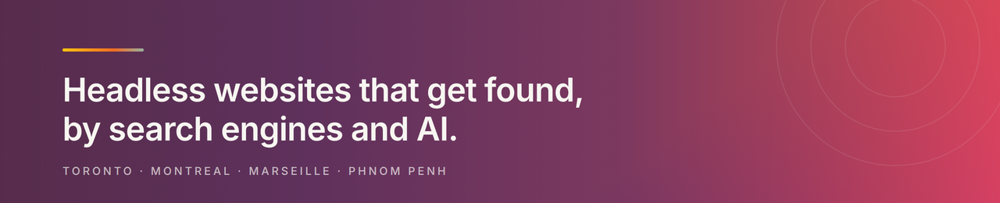

<div align="center">

<p></p>

<p></p>

**[dotfusion.com](https://www.dotfusion.com)** &nbsp;·&nbsp; [Our work](https://www.dotfusion.com/our-work) &nbsp;·&nbsp; [Services](https://www.dotfusion.com/services) &nbsp;·&nbsp; [Industries](https://www.dotfusion.com/industries) &nbsp;·&nbsp; [Blog](https://www.dotfusion.com/blogs) &nbsp;·&nbsp; [Podcast](https://www.dotfusion.com/podcasts) &nbsp;·&nbsp; [Contact](https://www.dotfusion.com/contact-us)

</div>


We are a Toronto-based digital agency. We build headless and composable content management system (CMS) websites with Answer Engine Optimization and search engine optimization built in from day one, then help enterprise teams scale their content operations after launch.

## The three problems we fix

Most enterprise websites arrive with the same set of constraints, and they compound over time:

- **Marketing cannot ship without engineering.** Changing a headline becomes a ticket. The site slows to the speed of the development backlog.
- **The site is invisible to AI.** People increasingly ask an assistant rather than scanning a results page. A site that search crawlers can read but answer engines cannot cite has lost a channel it never measured.
- **Content operations stop at launch.** The build gets a budget and a deadline. What happens on day 100, when several teams across time zones are publishing into the same system, usually does not.

We treat those as architecture problems rather than content problems, because that is where they are actually solved.

## What we do

- **Headless and composable CMS builds.** API-first architecture, so the content layer and the presentation layer can change independently.
- **Answer Engine Optimization and SEO.** Structured, machine-readable content, built in from the first sprint rather than retrofitted before launch.
- **Content operations.** The workflows, models, and governance that let a large team publish without a developer in the loop.
- **Platform selection and migration.** Evaluating what fits, then moving off the legacy system without losing the content or the rankings.
- **Custom software, commerce, and integration.** The parts of an enterprise stack a CMS does not cover.
- **Design systems and UX.** Research, interface design, and a component library the build can actually use.

## What we build with

<p>


</p>

<p>


</p>

<p>


</p>

## Our engineering standards are public

Most agencies keep their standards internal, if they have them written down at all. Ours are in the open, in **[Dotfusion/engineering-docs](https://github.com/Dotfusion/engineering-docs)**.

It holds how we write code, test it, ship it, secure it, make it accessible, and document it: our engineering principles, development workflow, testing strategy, accessibility standard (WCAG 2.1 AA, because our clients fall under AODA), security and secret handling, delivery and rollback, observability, incident response, and performance budgets.

We publish it for three reasons. A client or partner can see the bar before working with us. A developer joining the team reads one handbook rather than absorbing conventions by osmosis. And a standard that is being read cannot quietly rot.

The same repository doubles as a **Claude Code plugin marketplace**. Our standards ship to every developer's editor as skills, so they are applied while code is being written rather than looked up afterward:

```text
/plugin marketplace add Dotfusion/engineering-docs
/plugin install dotfusion-docs@dotfusion
```

Take any of it. It is MIT licensed, so fork it, adapt it, or lift the parts that fit your team.

## Where we are

**Toronto · Montreal · Marseille · Phnom Penh**

We started in 1998 as Dotmedia Design Group, building CD-ROMs in Huntington Beach, California, and became Dotfusion in 2001 when the Toronto office opened. Around 25 years of building digital products, most of it for enterprise teams.

We are a **certified B Corporation**, which commits us to a measured standard on how we treat our people, our clients, and our impact, and to being re-audited on it rather than asserting it once.

## Working with us

**Have a project?** [Get in touch](https://www.dotfusion.com/contact-us). We are most useful when a content operation has outgrown its platform.

**Want to join?** We do not have a careers page yet, but we are always glad to hear from strong engineers, designers, and content strategists, particularly people who care about the parts that rarely get credit: accessibility, performance, and documentation that stays true. [Say hello](https://www.dotfusion.com/contact-us) and mention what you would want to work on.

**Found a mistake in our docs?** [Open an issue](https://github.com/Dotfusion/engineering-docs/issues/new/choose). Corrections from outside the team are welcome.


<div align="center">

Challenging normal, for our clients and the way we run our business.

</div>
